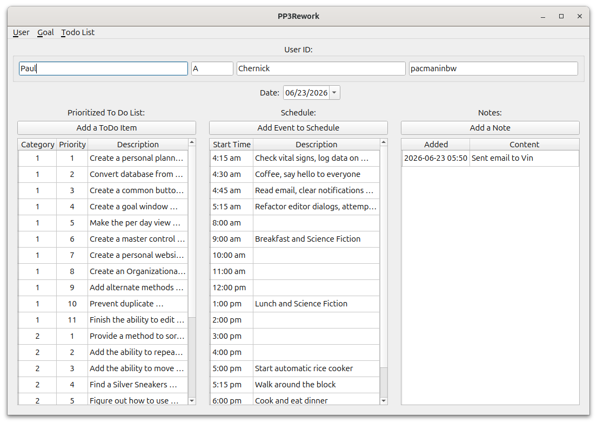
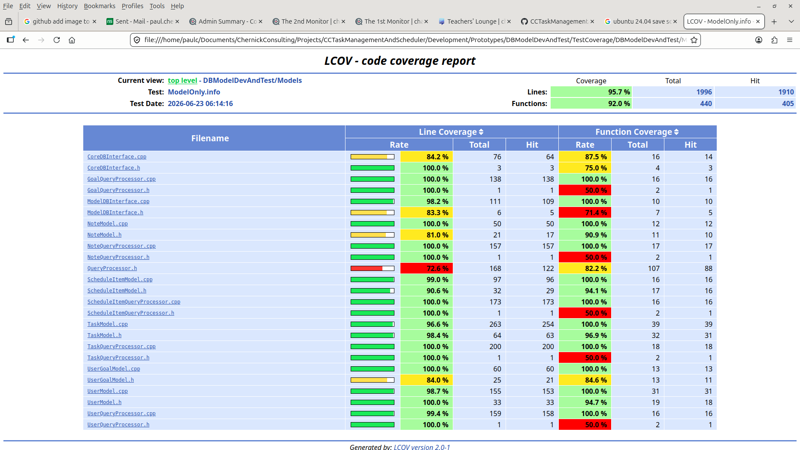

# CCTaskManagementAndScheduler
Personal planner, organizer and scheduler task management system using C++23, CMake, QT and MySQL

Over my career as a software engineer, I have found it helpful to use personal planners to schedule my time. First there were the paper planner from Daytimer. This was helpful to plan my time around meetings and appointments as well as keep some very brief notes. The drawback with this system was that I could not record goals or prioritize tasks.

I moved on to the Franklin Covey planner system which provided a system for laying out goals, prioritizing tasks on a daily basis and managing meetings and appointments as well as more space for notes. The drawback with this system was that it did not easily provide for multi-person software development projects when I had to manage projects. It was also not electronic in the era of PDAs and cell phones. I continued to use the Franklin Covey system but also to use Microsoft Project and Microsoft Outlook.

I still haven’t found an electronic system to merge all the features of the Franklin Covey paper planner with Microsoft Project and Outlook. My iPhone does the job of the Daytimer paper planner, but there is no way to prioritize tasks or align those tasks with goals. There are now much better project planning tools than Microsoft Project coupled with Outlook or Microsoft Exchange Server. Most or all Product Lifecycle Management tools ignore the smaller side of personal time management. As far as I know, Franklin Covey never extended their tools to include project management and their software didn’t work the same as the paper planner.

## The current version of the tool  

I have been using this planner since January of 2026 to organize my development of the planner.  

## Code Reviews  

Significant portions of the code were posted on the [Stack Overflow Code Review community](https://codereview.stackexchange.com/) July 7, 2026 through July 9, 2026. Issues found in those code reviews are currently being recorded.  
 - [A SQL Database to implement a per day at a view planner](https://codereview.stackexchange.com/questions/302562/a-sql-database-to-implement-a-per-day-at-a-view-planner)  
 - [The ScheduleItemModel implementation in the view per day planner](https://codereview.stackexchange.com/questions/302564/the-scheduleitemmodel-implementation-in-the-view-per-day-planner)  
 - [Follow up to Self / Unit test of polymorphic database model](https://codereview.stackexchange.com/questions/302569/follow-up-to-self-unit-test-of-polymorphic-database-model)  
 - [A second regression test of the polymorphic c++ database access classes](https://codereview.stackexchange.com/questions/302570/a-second-regression-test-of-the-polymorphic-c-database-access-classes)  
 - [A Qt C++ application: The schedule window in the day per view planner](https://codereview.stackexchange.com/questions/302590/a-qt-c-application-the-schedule-window-in-the-day-per-view-planner)  

## Test Coverage  

The models and database used by the tool access are tested separately. The test coverage of the models and database used by the tool is currently 95.7%.

There is a list of known issues.

## Development Environment  
 - Ubuntu 24.04  
 - g++ 14.2.0  
 - C++23
 - Qt 6.10.3  
 - cmake 4.3.3  
 - Boost 187  
 - mariadb  Ver 15.1 Distrib 10.11.14-MariaDB

